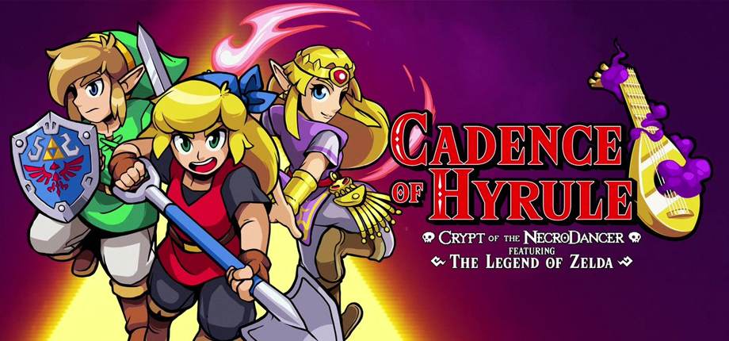

# _Cadence of Hyrule_ Resource Pack for Solarus

This repository provides musics, sounds, tilesets, sprites and scripts from the 2019 Nintendo Switch game [_Cadence of Hyrule_](https://en.wikipedia.org/wiki/Cadence_of_Hyrule),
adapted for [Solarus](https://www.solarus-games.org), a free and open-source game engine.

## Progress Notes
Please note that the ALTTP Resource Pack was used as a template to create this resource pack, therefore will contain some ALTTP assets as placeholders until the appropriate Cadence assets are assembled to replace them.

## Goal

The goal of this resource pack is also to provide at least all [data files required by Solarus](https://gitlab.com/solarus-games/solarus/blob/master/work/data_files.txt), in order to help people develop a game using Cadence graphics.

Since _Cadence of Hyrule_ is huge, there will always be missing or incomplete elements. Feel free to contribute!

## Branches

Branch `master` always points to the latest release of this resource pack.

The latest resource pack release is always compatible with the latest Solarus version.

Resources compatible with older versions or development versions of Solarus live in their own branches.

## How to use

### Create a new quest with Cadence resources

Using the Cadence resource pack for a new quest is straightforward. The idea is to create your quest as a copy of the Cadence resource pack rather than creating it from the quest editor:

1. Create a new empty folder for your quest.
2. Copy the `data` folder of the Cadence resource pack and all its content into your quest's folder.
3. Open your new quest with Solarus Quest Editor.
4. Edit the quest properties (<kbd>Ctrl</kbd>+<kbd>P</kbd>) to set a title, a write directory and other information of your game.

## License

This resource pack is licensed under multiple licenses:

- Graphics, sounds, names: Proprietary, copyrighted by [Nintendo](https://www.nintendo.com/) and [Brace Yourself Games](https://braceyourselfgames.com/).
- Lua scripts: [GNU General Public License v3.0](https://www.gnu.org/licenses/gpl-3.0.en.html).
- Data files: [Creative Commons Attribution-ShareAlike 4.0 International](https://creativecommons.org/licenses/by-sa/4.0/).
